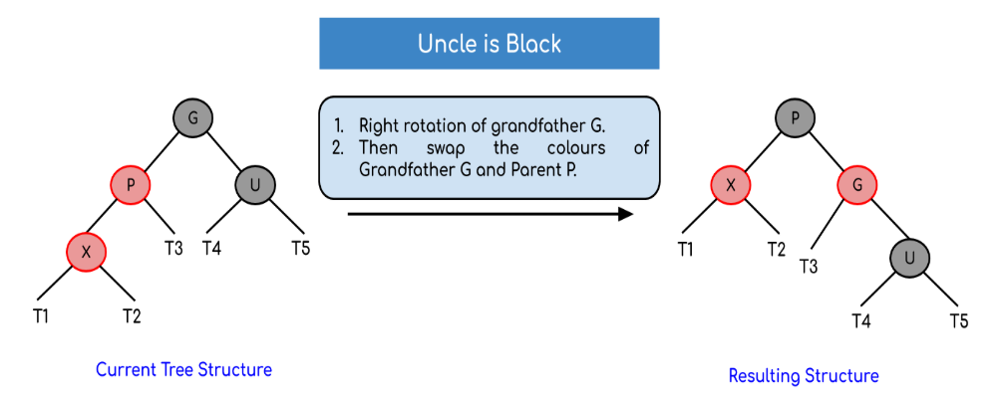
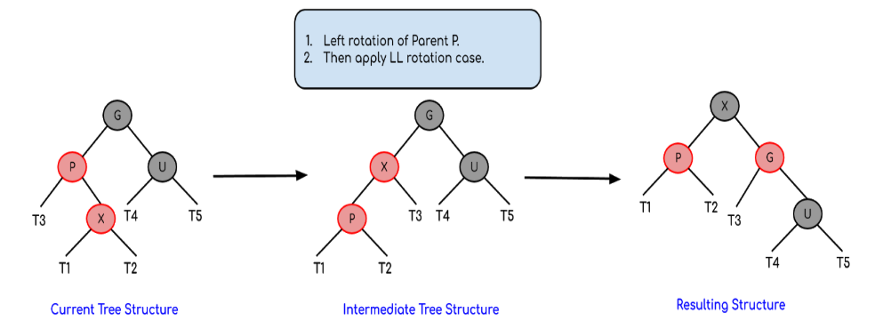

## Red Black Tree

Red Black tree have the same structure as the Binary Tree. However, it has the reposition feature that allow the height of the tree to be always optimized. That is, it is selt-position everytime after a node is added. Although the insertion will result in bigger time, the searching will be optimized, which is a reasonable tradeoff.

Let's talk about how to reposition the tree, as other aspects is cover within the binary search tree structure.

Rules of red-black tree:
1. The root of the tree is always black.
2. No 2 adjacent nodes are red.
3. Every path from the root to the leaves (nodes with null decendants) has the equals number of black nodes.
   
### Insertion
*Note that after "exit", the insertion process is terminated.*
*color of Null Node is consider Black.*

Generally, the tree rotation should be like this:

Steps:

1. Insert the node in the same mechanism of the BST. Then, set its color to be red.
2. Check if the node is root. If yes then change to black, exit. 
3. Check the color of its parent: if black then exit. 
4. Check the color of its uncle: If the uncle has a red colour then change the colour of the parent and uncle to black and that of grandfather to red colour and repeat the same process for grandfather. After finish, exit.
5. If the node’s uncle has black colour then there are 4 possible cases:

a. Left Left Case (LL rotation):

b. Left Right Case (LR rotation)

c. Right Righ Case (RR rotation)

D. Right Left Case (RL rotation)

